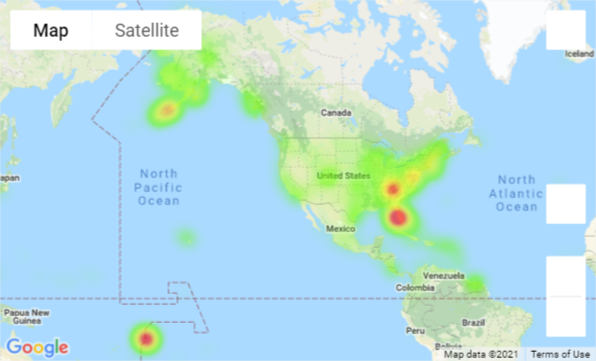

# Impact of COVID-19 on Flight Activity from January to July 2020

## Summary
This project evaluates the destinations for flights in the two periods of Jan - July 2019 and Jan - July 2020 to answer the following questions: 

**How has the pandemic impacted the carriers?**

**How has the pandemic impacted the domestic and international markets?**

**How has the pandemic impacted travel destinations?**

We retrieved monthly data for international and domestic markets from the US Department of Transportation, Bureau of Transporation Statistics. The data has monthly summaries of passengers with origins and destinations of the flights taken each month and is only current through July 2020. For this reason, we limited our analysis to compare only January to July in 2019 and 2020.

Data Source: [Air Carriers: T-100 Market (All Carriers) from the Bureau of Transportation Statistics, US Department of Transporation](https://www.transtats.bts.gov/Tables.asp?DB_ID=111&DB_Name=Air%20Carrier%20Statistics%20%28Form%2041%20Traffic%29-%20All%20Carriers&DB_Short_Name=Air%20Carriers) 

## Hypotheses

In this notebook, we will use the Independent T Test, a Google heat map, and various plots to evaluate the following hypotheses:

**Null Hypothesis** - There is no statistical significance in the percent change of passengers flying to the US and other countries in 2019 and 2020. 

**Alternative Hypothesis** - There is a statistical significance in the percent change of passengers flying to the US and other countries in 2019 and 2020.

## Findings
The analysis explores the following questsions:

1. How has the pandemic impacted the carriers?
    Top 10 impacted airlines in the US have lost more than 50% of their passengers. On average, the most affected airlines have suffered a reduction of more than 26 million transported passengers. Top 10 impacted airlines represents 74% of passengers lost during January – July 2020 vs 2019.

2. How has the pandemic impacted the domestic and international markets?
    * Covid-19 effected the world and in our project, flights (foregin and domestic), in a major way. The overall data showed that all flights were effected but as you look closer you can possibly see how the rest of the world may have taken the disease a little more serious than the United States
   
    * While there was a instant effect as the world went into lockdown, slowly but surely based on the data, it seems that things are getting back to normal. Internationally it seems that they are openining up the airways at a slower pace than the United States. 
    
    * The Implementation of quarantining as you enter countries may also be a reason for the slow progression of more International Flights. Some states in the United States have tried to implement the rules but mostly countries outside of the United States still have these rules in place and so while all flights are gradually on the uptick, it will be a slower movement for International Flights to get back to or surpass numbers in the past. 

3. How has the pandemic impacted travel destinations? Is there a statistical significance when looking at travel to the US vs travel to other countries? 
    * We can see that the majority of flights saw a substantial decrease in passengers. More than 6000 flights saw a 50 to 75% decrease in passengers. For example, the flight with the most passengers in 2019 saw a significant decrease in passengers between February and March of 2020. 
    
    * We created a heatmap to display the cities with the greatest change in passengers traveling to their airports and investigate two hot spots - Knoxville, TN and Sarasota, FL. 
     
    Both of these cities saw a large increase in travellers coming to their cities due to the addition of flights. There were only four countries that saw a positive change in the amount of passengers traveling to their countries where the change was greater than or equal to 100%: Samoa (2,142%), Suriname (1,316%), Costa Rica (270%), and the United States (170%).

    * We ran a linear regression and correlation analysis to investigate if there was a relationship between the flight distance and percent change in passengers. However, the correlation coefficient of -0.03 shows a very weak negative correlation between flight distance and precent change in the number of passengers.

    * We then ran an Independent T Test looking at flights destined for the US versus flights destined for other countries.This test showed a very high statistical significance in the difference between the percent change of passengers on these flights with a pvalue of 0.0045. 
 
These findings confirm the Alternative Hypothesis that there is a statistical significance in the percent change of passengers flying to domestic and international locations in 2019 and 2020.

## Files in the Repositiory
There are two Jupyter Notebooks, a Python file, and four folders in the repository.

Jupyter Notebooks:

* Data_Cleanup_Exploration - Notebook to clean up data files from data source and export a master csv for the team to work with.

* Data_Analysis - used to explore the answers to the questions posed above. A Google Maps API Key will be needed to run this notebook. Update the api_keys.py file with your API Key.

Folders:

* resources - holds the raw data files from the BTS website

* output_data - the output location for the cleaned master csv

* images - contains images generated by analysis notebooks

* archive - contains individual work files for the team members

## Status
_finished_

## Inspiration
This project was assigned as part of the UTSA Data BootCamp. The topic was inspired by current affairs and team member interests.
